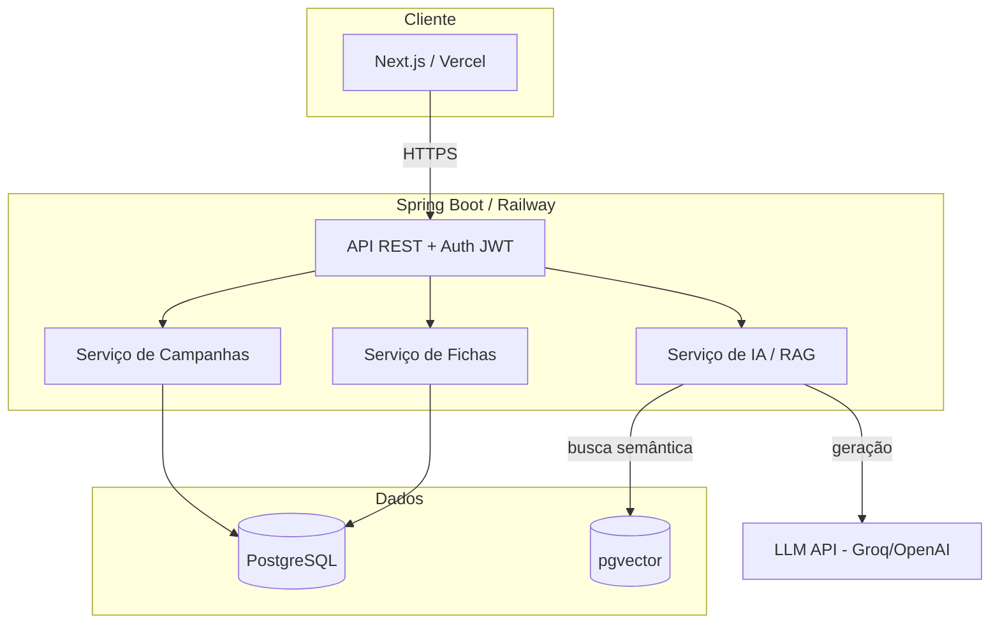
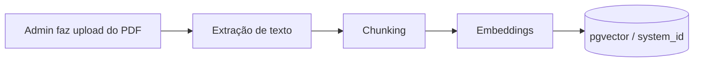
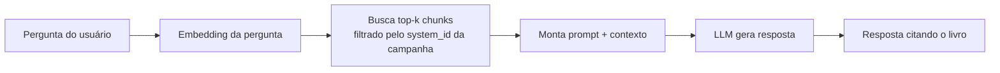
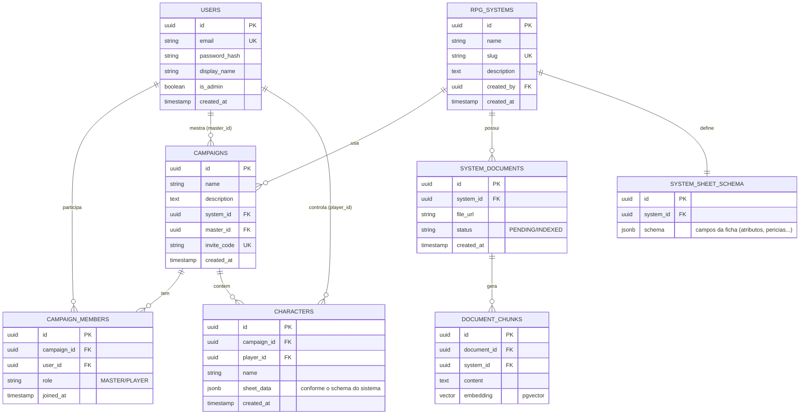

# Portal de RPG — Documento de Arquitetura (v0.1)

> Documento vivo. Reflete tudo que foi conversado até agora. Conforme você for prototipando as features, a gente atualiza.

---

## 1. Visão geral

Portal web para mestres e jogadores de RPG de mesa, inspirado em ferramentas tipo VTT/gerenciador de campanha. O fluxo central:

- Usuário cria conta.
- Pode **criar uma campanha** ou **ingressar** numa existente (via convite).
- Ao criar campanha, o mestre **escolhe o sistema** (D&D, Ordem Paranormal, Tormenta, etc.).
- Mestre convida players e tem **acesso total** às fichas (atributos, perícias, vida, etc.).
- Players gerenciam a própria ficha.

**Diferencial — IA contextualizada por sistema (RAG):**
Cada sistema tem o PDF do livro indexado. Dentro de uma campanha, mestre/player pergunta algo ("qual a cidade do Coração da Ordem?", regra específica) e a IA responde com base no livro **daquele sistema**.

---

## 2. Papéis e permissões

| Papel | Escopo | O que faz |
|---|---|---|
| **Administrador** | Global | Cadastra novos sistemas, faz upload dos PDFs, define o template de ficha de cada sistema |
| **Mestre** | Por campanha | Cria campanha, escolhe sistema, convida/remove players, vê e edita todas as fichas, usa a IA |
| **Player** | Por campanha | Cria e edita a própria ficha, participa da campanha, usa a IA |

> Importante: papel é **contextual à campanha** (exceto Admin, que é global). O mesmo usuário pode ser mestre numa campanha e player em outra. Por isso o papel mora na tabela de associação `campaign_members`, não no usuário.

---

## 3. Stack tecnológico

| Camada | Tecnologia | Deploy |
|---|---|---|
| Front-end | **Next.js** (React + TypeScript) | **Vercel** |
| Back-end | **Java + Spring Boot** | **Railway** (free tier inicial) |
| Banco | **PostgreSQL** | Railway (managed) |
| Vetores (IA) | **pgvector** (extensão do Postgres) | mesmo banco |
| IA / RAG | **Spring AI** + LLM via API (Groq/OpenAI) | — |
| Migrações | **Flyway** | versionado no repo |

Escala alvo: pequena (uso entre amigos). Free tier resolve. Se crescer, migração pro Hetzner CX22 é tranquila.

---

## 4. Arquitetura geral



**Fluxo de indexação do PDF (feito pelo Admin):**



**Fluxo de pergunta à IA (dentro de uma campanha):**



---

## 5. Modelo de dados



**Decisão-chave: ficha como `jsonb`.**
Como o Admin cadastra **sistemas novos dinamicamente**, a estrutura da ficha não pode ser fixa em colunas. Cada sistema define seu template em `SYSTEM_SHEET_SCHEMA.schema`, e cada personagem guarda os dados em `CHARACTERS.sheet_data` (JSONB) conforme esse template. Ficha de D&D ≠ ficha de Ordem Paranormal, e o banco aguenta as duas sem mudar schema. PostgreSQL com JSONB é ideal pra isso (indexável, consultável).

---

## 6. Design da API (REST)

Base: `/api`. Auth via **JWT** (access + refresh). Autorização por papel/escopo.

### Autenticação
```
POST   /auth/register
POST   /auth/login
POST   /auth/refresh
```

### Sistemas (Admin)
```
GET    /systems                      lista sistemas
POST   /systems                      cria sistema            [ADMIN]
GET    /systems/{id}
PUT    /systems/{id}                                          [ADMIN]
GET    /systems/{id}/sheet-schema    template da ficha
PUT    /systems/{id}/sheet-schema    define template         [ADMIN]
POST   /systems/{id}/documents       upload PDF + indexa     [ADMIN]
GET    /systems/{id}/documents       status de indexação     [ADMIN]
```

### Campanhas
```
POST   /campaigns                    cria (vira MASTER)
GET    /campaigns                    minhas campanhas
GET    /campaigns/{id}
PUT    /campaigns/{id}                                        [MASTER]
DELETE /campaigns/{id}                                        [MASTER]
POST   /campaigns/{id}/invite        gera invite_code        [MASTER]
POST   /campaigns/join               entra via invite_code
GET    /campaigns/{id}/members
DELETE /campaigns/{id}/members/{userId}                       [MASTER]
```

### Personagens / Fichas
```
POST   /campaigns/{id}/characters                 cria ficha
GET    /campaigns/{id}/characters    MASTER vê todas, PLAYER vê a sua
GET    /campaigns/{id}/characters/{charId}
PUT    /campaigns/{id}/characters/{charId}        dono ou MASTER
DELETE /campaigns/{id}/characters/{charId}        dono ou MASTER
```

### IA (RAG)
```
POST   /campaigns/{id}/ai/ask        pergunta escopada ao sistema da campanha
```
Body: `{ "question": "..." }` → resposta filtra os chunks por `system_id` da campanha.

---

## 7. Estratégia de ambientes (dev / staging / prod)

Spring Boot com **profiles**:

```
application.yml             # config comum
application-dev.yml         # localhost, banco local
application-staging.yml     # staging
application-prod.yml        # produção
```

- Ativação: `SPRING_PROFILES_ACTIVE=dev|staging|prod` (variável de ambiente, injetada no Docker/Railway).
- **Secrets** (senhas de banco, API key do LLM, segredo JWT): variáveis de ambiente no Railway — nunca commitadas.
- **Migrações de schema**: Flyway roda automático no boot, versionando o banco igual entre os três ambientes (`V1__init.sql`, `V2__add_characters.sql`, ...).
- Front no Vercel: usa Preview Deployments (cada PR vira um ambiente) + Production.

---

## 8. Decisões em aberto

- [ ] **LLM definitivo**: Groq (rápido, free tier generoso) vs OpenAI (qualidade). Recomendo começar no Groq.
- [ ] **Upload de PDF**: storage do arquivo bruto — Railway volume, S3/R2, ou só processar e descartar guardando os chunks?
- [ ] **Real-time**: rolagem de dados / atualização de ficha ao vivo precisa de WebSocket, ou polling resolve no MVP?
- [ ] **Editor de ficha**: o front renderiza o formulário dinamicamente a partir do `sheet-schema`? (recomendado — evita hardcode por sistema)
- [ ] **Citações da IA**: a resposta deve indicar página/seção do livro?

---

## 9. Próximos passos sugeridos

1. Fechar a lista de features (você está prototipando) e mapear no documento.
2. Definir o `sheet-schema` de **um** sistema piloto pra validar o modelo JSONB.
3. Subir o esqueleto: Spring Boot + Postgres no Railway, Next.js no Vercel, auth JWT.
4. Implementar o CRUD de campanha → membro → ficha antes da IA.
5. Plugar o RAG por último, com 1 PDF de teste.
